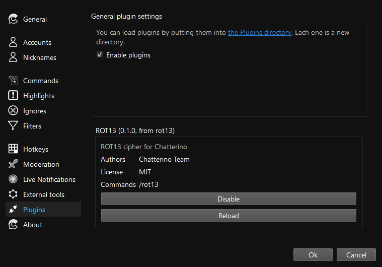

# Introduction

<!-- prettier-ignore -->
!!! warning "Alpha Warning"
    Plugins are not yet stable. **There will be breaking changes!**

If Chatterino is compiled with the `CHATTERINO_PLUGINS` CMake option, it can
load and execute Lua files. Note that while there are attempts at making this
decently safe, we cannot guarantee safety.

## Plugin structure

Chatterino searches for plugins in the `Plugins` directory in the _[Chatterino folder](../Settings.md#where-is-my-chatterino-folder-located)_.
Each plugin should have its own directory:

<!-- This is a hack to support annotations in plain text -->

```tex
📁 Chatterino/ %(1)!
╰─ 📁 Plugins/
   ├─ 📁 my_first_plugin/
   │  ├─ 📜 info.json
   │  ╰─ 📜 init.lua
   │
   ╰─ 📁 my_second_plugin/
      ├─ 📜 info.json
      ╰─ 📜 init.lua
```

1. See _[Where is my Chatterino folder located?](../Settings.md#where-is-my-chatterino-folder-located)_.

A plugin consists of at least two files:

-   `info.json` contains metadata about the plugin, like its name, description,
    authors, homepage link, tags, version, license name ([reference](Reference.md#metadata)).
-   `init.lua` will be the file loaded when the plugin is enabled. Other files can be loaded through [`require()`](Reference.md#requiremodname).

## Example

In this example we'll build a plugin that de-/encrypts text using the [ROT13](https://en.wikipedia.org/wiki/ROT13) cipher.

Let's create a new folder in our _Plugins_ directory named `rot13`. Inside, we'll create two empty files: `info.json` and `init.lua`:

```tex
📁 Chatterino/ %(1)!
╰─ 📁 Plugins/
   ╰─ 📁 rot13/
      ├─ 📜 info.json
      ╰─ 📜 init.lua
```

1. See _[Where is my Chatterino folder located?](../Settings.md#where-is-my-chatterino-folder-located)_.

Before we write the code, let's edit the `info.json` file to declare some metadata about the plugin:

```json title="info.json"
{
    "$schema": /* (1)! */ "https://raw.githubusercontent.com/Chatterino/chatterino2/master/docs/plugin-info.schema.json",
    "name": "ROT13",
    "description": "ROT13 cipher for Chatterino",
    "authors": ["Chatterino Team"],
    "version": "0.1.0",
    "license": "MIT"
}
```

1. This schema is used by editors to check the validity of the metadata.

Now let's start writing some code. If you want to get diagnostics for the Lua code, see [Editor Integration](#editor-integration).

First, we want to add the "business logic" - the de-/encryption function:

```lua title="init.lua" linenums="1"
-- ASCII values of the respective character
local ASCII_UPPER_A = 0x41
local ASCII_UPPER_Z = 0x5A
local ASCII_LOWER_A = 0x61
local ASCII_LOWER_Z = 0x7A

--- De-/encrypts a string `input` with the ROT13 cipher.
---
---@param input string The string to de-/encrypt.
---@return string
local function rot13(input)
    local buf = ""
    for i = 1, #input do
        local codepoint = input:byte(i)
        if codepoint >= ASCII_LOWER_A and codepoint <= ASCII_LOWER_Z then
            codepoint = (((codepoint - ASCII_LOWER_A) + 13) % 26) + ASCII_LOWER_A
        elseif codepoint >= ASCII_UPPER_A and codepoint <= ASCII_UPPER_Z then
            codepoint = (((codepoint - ASCII_UPPER_A) + 13) % 26) + ASCII_UPPER_A
        end
        buf = buf .. string.char(codepoint)
    end

    return buf
end
```

In the `rot13` function, we loop through each character (or, more correctly, byte) of the input and "rotate" all characters in _A-Z_ and _a-z_ 13 characters forwards/backwards (_A_ ↔ _N_; _B_ ↔ _O_; _z_ ↔ _m_).

Now, we want to register a command named `/rot13` that takes all arguments and de-/encrypts them with ROT13. We're using [`c2.register_command`](Reference.md#register_commandname-handler) to register the command and [`c2.send_msg`](Reference.md#send_msgchannel-text) to send a message in a channel.
As we get the arguments as an array of words, we need to join them to a message separated by spaces first. To do this, we're using [`table.concat`](https://www.lua.org/manual/5.4/manual.html#pdf-table.concat):

```lua title="init.lua" linenums="26"
c2.register_command("/rot13", function(ctx)
    local msg = table.concat(ctx.words, " ", 2--[[ (1)! ]])
    c2.send_msg(ctx.channel_name, rot13(msg))
end)
```

1. Skip the first element (start at index `2`). The handler receives the whole message, which includes the command - for example `/rot13 foo bar` will be split into `#!lua {"/rot13", "foo", "bar"}`.

Let's start Chatterino and enable our plugin.

In the settings, go to _Plugins_, enable them and enable our plugin:



To test the plugin, run the command:

```text
> /rot13 foo BAR
User: sbb ONE

> /rot13 sbb ONE
User: foo BAR

> /rot13
...
```

Our plugin seems to work. Except that we don't handle empty messages. Let's add a usage message if we're invoked with no arguments.

```lua title="init.lua" linenums="26" hl_lines="2-5"
c2.register_command("/rot13", function(ctx)
    if #ctx.words < 2 then
        c2.system_msg(ctx.channel_name, "Usage: /rot13 <message>")
        return
    end

    local msg = table.concat(ctx.words, " ", 2)
    c2.send_msg(ctx.channel_name, rot13(msg))
end)
```

Now our plugin handles all input.

<details>
<summary>Final init.lua</summary>

```lua title="init.lua" linenums="1"
-- ASCII values of the respective character
local ASCII_UPPER_A = 0x41
local ASCII_UPPER_Z = 0x5A
local ASCII_LOWER_A = 0x61
local ASCII_LOWER_Z = 0x7A

--- De-/encrypts a string `input` with the ROT13 cipher.
---
---@param input string The string to de-/encrypt.
---@return string
local function rot13(input)
    local buf = ""
    for i = 1, #input do
        local codepoint = input:byte(i)
        if codepoint >= ASCII_LOWER_A and codepoint <= ASCII_LOWER_Z then
            codepoint = (((codepoint - ASCII_LOWER_A) + 13) % 26) + ASCII_LOWER_A
        elseif codepoint >= ASCII_UPPER_A and codepoint <= ASCII_UPPER_Z then
            codepoint = (((codepoint - ASCII_UPPER_A) + 13) % 26) + ASCII_UPPER_A
        end
        buf = buf .. string.char(codepoint)
    end

    return buf
end

c2.register_command("/rot13", function(ctx)
    if #ctx.words < 2 then
        c2.system_msg(ctx.channel_name, "Usage: /rot13 <message>")
        return
    end

    local msg = table.concat(ctx.words, " ", 2)
    c2.send_msg(ctx.channel_name, rot13(msg))
end)
```

</details>

## Editor Integration

If you're using an editor that supports the [Language Server Protocol](https://microsoft.github.io/language-server-protocol/), you can use the [lua-language-server](https://github.com/LuaLS/lua-language-server). This provides completion and diagnostics for your Lua code.

Chatterino provides a metadata file with types in the `docs` folder of [`chatterino2`](https://github.com/Chatterino/chatterino2). Put the absolute path to the `docs` folder of your local clone in `Lua.workspace.libraries`.

For Visual Studio Code, you can use the following settings:

```json title=".vscode/settings.json"
{
    "Lua.workspace.library": ["<path-to-chatterino2-clone>/docs/plugins"]
}
```

Once plugins mature, an add-on will be added to the official [LLS-Repository](https://github.com/LuaLS/LLS-Addons).

## Plugins with Typescript

If you prefer, you may use [TypescriptToLua](https://typescripttolua.github.io)
to typecheck your plugins. There is a `chatterino.d.ts` file describing the API
in this directory. However, this has several drawbacks like harder debugging at
runtime.
